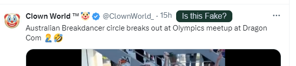

# TrueMedia Extension: Evaluate Suspect Content with TrueMedia

## Local Installation

To run and test the extension on your local machine:

1. Clone this repository.
2. Navigate to `chrome://extensions/` in your Chrome browser.
3. Enable "Developer mode" using the toggle switch at the top right corner.
4. Click on "Load unpacked" at the top left.
5. Select the cloned repository folder.

## Publishing the Extension

**NOTE:** Ensure all `TODO` comments are addressed in the codebase.

1. Follow the steps outlined in the [Chrome Web Store publishing guide](https://developer.chrome.com/docs/webstore/publish).

## Installing from Chrome Web Store

1. Find the extension on the [Chrome Web Store](https://chromewebstore.google.com/search/truemedia).
2. Click on the extension and then select `Add to Chrome`.

## Usage

1. Navigate to a story on X (formerly Twitter), Facebook, or another supported platform.  
   _(Supported platforms: `TODO`)_
2. To verify the authenticity of the story you're reading, click the extension button at the top of the page. This will send the URL to TrueMedia for evaluation.

## TODO

1. set the correct api url in host_permissions of manifest.json
1. set correct api url in base.js
1. Update all asset logos as needed
   1. Ensure svgs work as expected in store pages
1. Update branding colors and fonts as needed
1. Check copy in popup
1. Add specific domain code for:
   1. facebook
   1. googleDocs
   1. googleDrive
   1. instagram
   1. mastodon
   1. reddit
   1. tiktok
